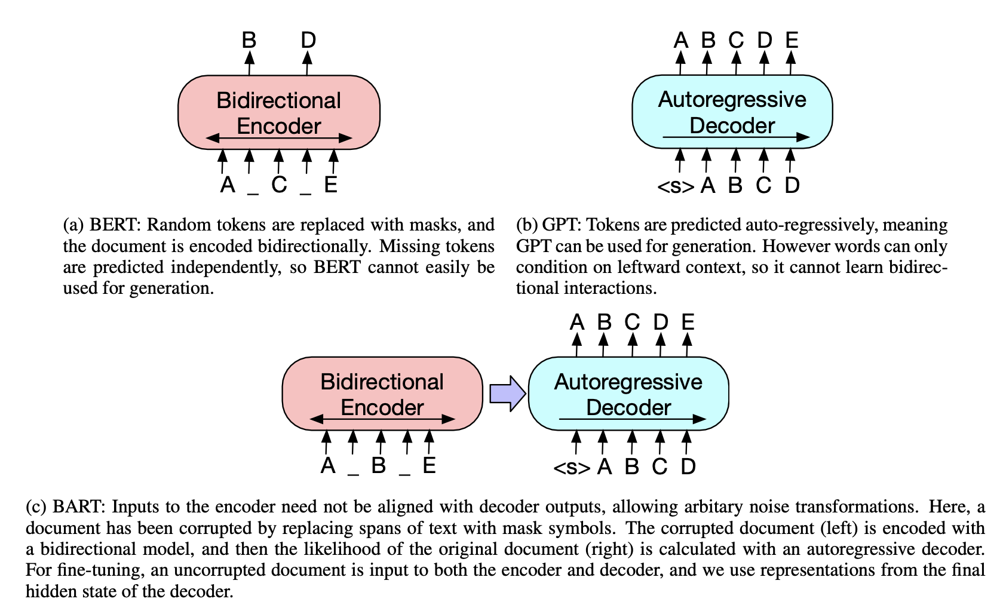

# BART : Denoising Sequence-to-Sequence Pre-training for Natural Language Generation, Translation, and Comprehension

## Keywords

`GPT`; `BERT`; `AR(Auto Regression)`; `AE(Auto Encoding)`; `Bidirectional`; `transformer`;

## Introduction

BERT의 성능을 generalize 하기 위해 다음의 방식을 적용한다.

- BART : pretrain model = Bidirectional(generalize BERT) + Auto-regressive(GPT)
    - 무작위적으로 corrupted sentence(`AE`) : 최고의 성능!!
        - 조작변인(hyper-parameters) : `span(spanBERT)` `order(Xlnet)`
        - `MLM` `NSP` objective 의 환경 generalize 효과
    - sequence-to-sequence model to reconstruct sentence(`AR`)
        
        
        
    
    <aside>
    👉 encoder(AE), decoder(AR) 의 objective 를 서로 다르게 설계
    
    </aside>
    
- 강점(when fine-tuned by…) : 을 실험에서 확인
    - text generation
    - comprehension
- New way of Fine-tuning
    - machine translation
        - 기존에 없었던 transformer layer 위에 BART model을 얹는다.(encoder 위에)
            - foreign language → noised english (can say target-side LM objective)
            - strong performance in back translation
                - what is back translation
                    
                    
                    
                    
                    
                

## Model

- Architecture
    - sequence-to-sequence Transformer from `GPT` but 
    (`Activation Function` & `Initialization`)
        - ReLU → GeLU
        - initialize parameters from $\mathcal{N}(0,0.02)$
            - 0 에 근접하고 robust 하게 초기화했다는 거
    - Base : encoder : 6, decoder : 6 (layers)   Large : encoder :12, decoder :12 (layers)
    `BERT`와 비슷하지만 다음과 같은 차이 
    (`Encoder`, `Decoder` architecture by N of `params`)
        - decoder 각각의 레이어에서 encoder 의 끝단 hidden layer(output전에) cross-attention
        - BERT 방식의 word-prediction 전에 feed-forward network 사용하지 않음
            - what is feed-forward network
                
                
                
                Feed Forward neural network helps a lot in finding the more contextual information related to particular pairs of words in sequences . It is not very clear why we need another feed forward network if we already have an attention layer which does the same job but it helps to improve the accuracy of the model you can see [here](https://youtu.be/YIEe7d7YqaU)
                 if you wanna know more detail about it.
                
        - 이렇게 했을 때 10% parameter 많아짐

- Pre-training BART : trained by corrupting docs & optimizing reconstruction loss
    - decoder output : $\hat{y}$. original doc : $y$
    - applicable to all kinds of corrupted sentences(currently presented)
        - all sentences masked → LM
    - Token Masking `MLM(BERT)`
    - Token Deletion : some tokens deleted from input
        - predict where the deleted tokens
    - Test Infilling `span(spanBERT)`
        - length : poisson distribution $(\lambda =3)$ : how many are gone
            - fixed span length
            - span → masked token(sigle token)
            - learn how many are gone(not masked tokens, just tokens)
            
            - spanBERT
                - span from different distribution
                - span → masked token’s’(several tokens)
            
            ```python
            while len(mask) < mask_num:
            	span_len = np.random.choice(self.lens, p=self.len_distrib)
            
            									....
            ```
            
    - Sentence Permutation `order(Xlnet)`
        - full stop(마침표) sentences shuffled in random order
    - Document Rotation
        - selected pivot : front, remainder : rotated
        
        
        

## Fine-tuning

- Sequence Classification Tasks :Sequence classification is **the task of predicting a class label given a sequence of observations**
    - input : identical → encoder & decoder
    - output : decoder 끝단 hidden state 의 토큰($\hat{y}(class)$) → multi-class linear classifier
    
    
    

- Token Classification Tasks
    - input : complete document → encoder & decoder
    - output : top hidden state representation of words from decoder $\hat{y}^{(1,T)}$
    
- Sequence Generation Tasks
    - since `AR` (`GPT`)
        - abstractive QA
        - summerization
    - input sequences : information copied and manipulated(related to denoising pretrain objective)
    - input : input sequences → encoder
    - output ←decoder(`AR`)
    
- Machine Translation
    - using entite `BART` model is superier than presented models(using lone encoder)
        - single pretrained decoder
        - pretrained encoder + new encoding layer(train : Bitext) ❗️this is not pretrained
            - pretrained encoder embedding layer replaced by a new layer(randomly initialized)
            - trained end-to-end (task based learning—no transfer)
                
                
                
                - foreign → English
                - freeze almost params except the layer
                    - positional embeddings
                    - self-attention input projection matrix of first of whole encoder layer
                    (this is why “BART model is stacked above a few ad- ditional transformer layers.”)
                - train all params (for small iter_nums)
                

## Comparing Pre-training Objectives

Let’s compare our(BART’s) denoising performance with others

Base : encoder(6 layers) decoder(6 layers) hidden size(768)

- Comparison Objective
    - deciding obective to compare was challenging due to different train set, architectural difference, fine-tuning procedures (all because of different environment)
        - applicate to recently strong pre-training approaches for discriminative & generation tasks
        - aim to control unrelated pre-train objectives
        - however we ‘did minor changes separatly to objectives’ to improve performance
        (viewpoint from strict `pre-train`)
            - $\texttt{learing\_rate}$
            - usage of layer normalization
            
- Language Model
    - `GPT` $\sim$ `BART decoder` - (cross-attention)

- Permutated Language Model(based on `XLNet` )
    - 1/6 of tokens and shuffle
    - (but not-use positional embedding, across segments)

- Masked Language Model (based on `BERT`)
    - 15% of token → masked token

- Multitask Masked Language Model(based on `UniLM`)
    - additional self-attention masks
        - left-to-right : 1/6
        - right-to-left : 1/6
        - unmasked : 1/3
        - ??

- Masked Seq-to-Seq (based on `MASS` )
    - mask span(50% tokens)
    - train sequence to sequence (predict : masked tokens)# BART-review
